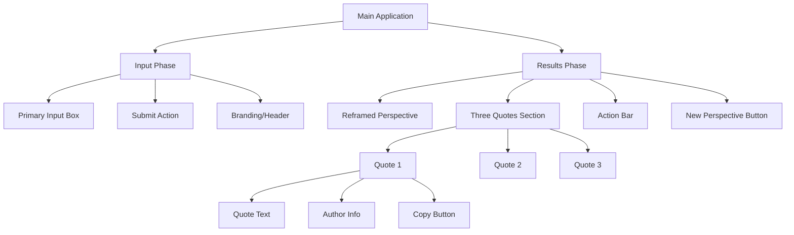
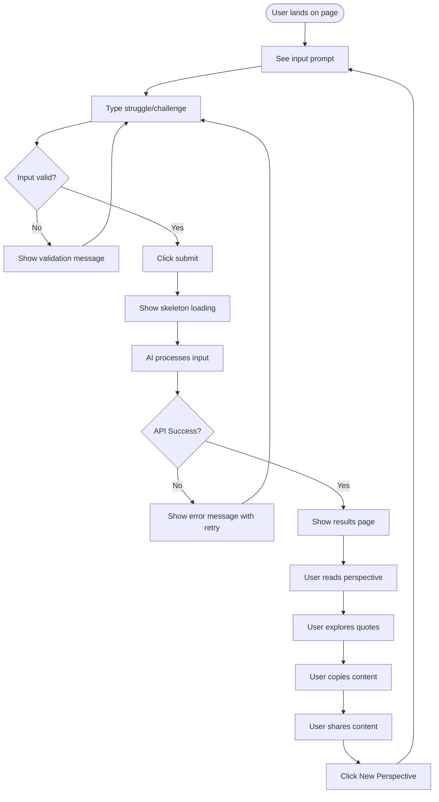
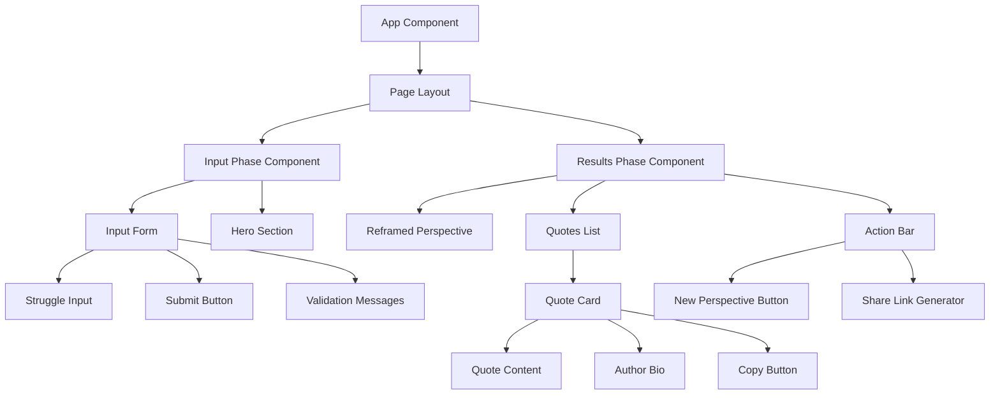
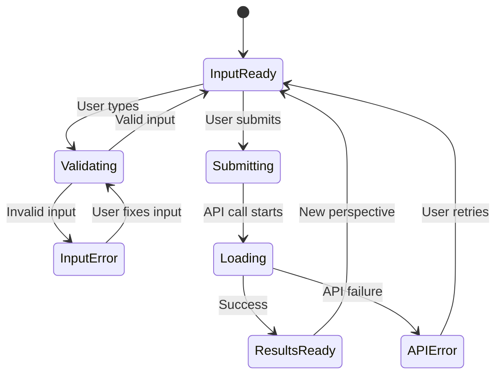

# Design Requirements Document: Perspective Shift

**Generated from:** `prd-perspective-shift.md`  
**Date:** 2025-09-08  
**Design Complexity:** Moderate  
**Future Requirements Considered:** User favorites/bookmarking, Multi-language support, Touch-first mobile optimization

## Executive Summary

### Design Goals
- **Primary:** Create a calm, serene digital space that promotes emotional well-being and positive perspective shifts
- **Secondary:** Ensure maximum readability and accessibility across all devices with touch-first mobile optimization
- **Tertiary:** Build a foundation that can accommodate future bookmarking and multi-language features

### Future-Proofing Considerations
- **User Favorites/Bookmarking:** Component structure allows for future heart/save icons and user preference storage
- **Multi-language Support:** Typography and layout accommodate varying text lengths and RTL languages
- **Touch Optimization:** All interactive elements sized for one-handed mobile usage
- **Accessibility:** WCAG 2.1 AA compliance foundation for screen readers and keyboard navigation

### One-Way Door Decisions to Avoid
- **Fixed Quote Layout:** Avoid rigid 3-column layouts that can't adapt to different quote counts
- **Hard-coded Sharing:** Design sharing components to accommodate multiple future platforms
- **Single Typography Scale:** Use flexible type system that supports multiple languages

## Information Architecture

### Content Hierarchy


### Navigation Patterns
- **Primary Navigation:** Single-page state transitions (Input → Results)
- **Secondary Navigation:** "New Perspective" button to return to input state
- **No Breadcrumbs:** Simple back-and-forth flow doesn't require breadcrumb navigation
- **State Management:** Clear visual indication of current phase (input vs. results)

### Content Organization
- **Above the fold:** Input prompt and text box (Input Phase) / Reframed perspective (Results Phase)
- **Progressive disclosure:** Results replace input completely, quotes follow perspective
- **Grouping strategy:** Related content (quote + author + copy) grouped in cards
- **Prioritization:** Perspective statement most prominent, quotes equal secondary prominence

## User Experience Design

### User Flows

#### Primary Flow: Perspective Shift Journey


#### Secondary Flows
- **Error Recovery:** Clear error messages with "Try again" functionality returning to input
- **First-Time User:** No onboarding needed - self-explanatory interface
- **Mobile User:** Touch-optimized with large tap targets and one-handed usage patterns
- **Copy/Share Flow:** Individual copy buttons per quote, plus shareable link generation

### Interaction Patterns

#### Form Interactions
- **Input validation:** Real-time character count, minimum length validation
- **Error states:** Inline validation messages with constructive guidance
- **Success states:** Smooth transition to skeleton loading screen
- **Loading states:** Skeleton screens showing expected result structure

#### Data Display
- **Empty states:** N/A for this application flow
- **Loading states:** Skeleton screens with animated placeholders for perspective and quotes
- **Error states:** Friendly error messages with retry options and support guidance
- **Success states:** Smooth animation into results with staggered quote reveals

#### Micro-interactions
- **Hover effects:** Subtle color shifts on buttons and interactive elements
- **Click feedback:** Immediate visual confirmation for all button presses
- **Transitions:** Smooth fade transitions between input and results phases
- **Copy Feedback:** Toast notifications confirming successful copy actions

## Visual Design System

### Design Principles
- **Serenity:** Calming gradient backgrounds and gentle typography create peaceful atmosphere
- **Clarity:** High contrast text and clear visual hierarchy ensure excellent readability
- **Simplicity:** Minimal interface focuses attention on content and emotional journey
- **Accessibility:** Color choices and typography support screen readers and visual impairments

### Color Palette
```
Primary Gradient Background:
- Start: #FF8FB1 (Warm Pink) - Top of viewport
- End: #C8A8E9 (Soft Purple) - Bottom of viewport

Text Colors:
- Primary Text: #2D1B35 (Dark Purple) - Main content, high contrast
- Secondary Text: #5A4B6B (Medium Purple) - Author info, metadata
- Accent Text: #1A1A2E (Deep Navy) - Headings and emphasis

Interactive Elements:
- Button Primary: #6B46C1 (Royal Purple) - Primary actions
- Button Hover: #553C9A (Darker Purple) - Hover states
- Button Secondary: rgba(107, 70, 193, 0.1) (Light Purple) - Secondary actions
- Copy Button: #059669 (Green) - Copy action feedback

System Colors:
- Success: #10B981 (Emerald Green)
- Warning: #F59E0B (Amber)
- Error: #EF4444 (Red)
- Info: #3B82F6 (Blue)
```

### Typography Scale
- **Display:** Inter, 48px, 700 weight - Page title and main headings
- **Heading H1:** Inter, 36px, 600 weight - Section headers, reframed perspective
- **Heading H2:** Inter, 24px, 600 weight - Quote text
- **Body Large:** Inter, 18px, 400 weight - Main perspective text, input placeholder
- **Body:** Inter, 16px, 400 weight - Author biographies, helper text
- **Caption:** Inter, 14px, 400 weight - Button labels, metadata
- **Code/Monospace:** JetBrains Mono, 14px, 400 weight - Technical content if needed

### Spacing System
- **XS:** 4px - Icon padding, tight element spacing
- **SM:** 8px - Button padding, small component spacing  
- **MD:** 16px - Standard component padding, text line spacing
- **LG:** 24px - Section spacing, card internal padding
- **XL:** 32px - Major section separation
- **2XL:** 48px - Phase separation (input to results)
- **3XL:** 64px - Viewport margin on large screens

### Component Specifications

#### Buttons
```
Primary Button (Submit, New Perspective):
- Background: #6B46C1
- Text: #FFFFFF
- Border: none
- Padding: 12px 24px (MD LG)
- Border radius: 8px
- Font: Inter, 16px, 500 weight
- Min-width: 120px
- Min-height: 48px (touch target)
- Hover state: Background #553C9A, subtle scale transform
- Focus state: 2px outline #6B46C1, offset 2px
- Disabled state: Background #D1D5DB, Text #9CA3AF

Copy Button:
- Background: transparent
- Text: #059669
- Border: 1px solid #059669
- Padding: 8px 16px (SM MD)
- Border radius: 6px
- Font: Inter, 14px, 500 weight
- Min-height: 36px
- Hover state: Background #F0FDF4, border #047857
- Active state: Background #059669, text #FFFFFF
- Success state: Show checkmark icon, "Copied!" text
```

#### Form Elements
```
Input Field (Main text input):
- Background: rgba(255, 255, 255, 0.9)
- Border: 2px solid rgba(107, 70, 193, 0.2)
- Padding: 16px 20px (MD LG)
- Border radius: 12px
- Font: Inter, 18px, 400 weight
- Placeholder color: #9CA3AF
- Min-height: 120px (textarea)
- Focus state: Border #6B46C1, shadow 0 0 0 3px rgba(107, 70, 193, 0.1)
- Error state: Border #EF4444, background rgba(239, 68, 68, 0.05)
- Character counter: Inter, 14px, #6B7280, positioned bottom-right

Labels:
- Font: Inter, 16px, 600 weight
- Color: #2D1B35
- Spacing: 8px below label to input

Validation Messages:
- Font: Inter, 14px, 400 weight
- Color: #EF4444 (error) / #059669 (success)
- Spacing: 4px above input field
- Icon: Small warning/success icon alongside text
```

#### Content Display Cards
```
Quote Cards:
- Background: rgba(255, 255, 255, 0.8)
- Border: none
- Box-shadow: 0 4px 6px rgba(0, 0, 0, 0.07)
- Border-radius: 16px
- Padding: 24px (LG)
- Margin bottom: 16px (MD) between cards
- Backdrop-filter: blur(10px) for glass morphism effect

Quote Text:
- Font: Inter, 20px, 400 weight
- Color: #2D1B35
- Line-height: 1.6
- Margin bottom: 16px (MD)
- Quotation marks: Stylized large quotes

Author Information:
- Font: Inter, 16px, 400 weight  
- Color: #5A4B6B
- Format: "— Author Name, Brief Bio"
- Margin bottom: 16px (MD)

Reframed Perspective Card:
- Background: rgba(255, 255, 255, 0.9)
- Border: 2px solid rgba(107, 70, 193, 0.1)
- Border-radius: 20px
- Padding: 32px (XL)
- Margin bottom: 32px (XL)
- Box-shadow: 0 8px 25px rgba(107, 70, 193, 0.15)
```

## Component Architecture

### Component Hierarchy


### Reusable Components

#### Layout Components
- **PageContainer:** Max-width 1200px, responsive padding, centered content
- **GradientBackground:** Fixed position gradient overlay, consistent across phases
- **ContentWrapper:** Flexible container for phase-specific content

#### UI Components
- **Button:** Variants (primary, secondary, copy), sizes (small, medium, large), states
- **Card:** Glass morphism styling, flexible padding, shadow variations
- **TextArea:** Auto-resize, validation states, character counting
- **LoadingSkeleton:** Animated placeholders matching result structure
- **Toast:** Copy confirmations, error messages, success feedback

#### Feature-Specific Components
- **StruggleInput:** Complete input form with validation and submission
- **PerspectiveCard:** Formatted display for AI-generated reframed perspective
- **QuoteCard:** Quote text, author info, and copy functionality
- **PhaseTransition:** Smooth animation between input and results phases

### State Management Patterns

#### Application State


#### Quote Card State Management
- **Initial:** Quote text and author displayed, copy button ready
- **Copying:** Brief loading state on copy button
- **Copied:** Success state with checkmark, reverts after 2 seconds
- **Error:** Copy failure state with retry option

## Responsive Design Strategy

### Breakpoint Strategy
```
Mobile Portrait: 320-479px
- Single column layout
- Full-width input and cards
- Stack all elements vertically
- Larger touch targets (min 48px)
- Reduced padding for content efficiency

Mobile Landscape: 480-767px  
- Maintain single column
- Increased horizontal padding
- Larger text areas for landscape typing
- Optimized for one-handed use

Tablet Portrait: 768-1023px
- Single column with increased max-width
- Enhanced spacing and padding
- Larger typography for better reading
- Touch-optimized interactions

Desktop: 1024px+
- Centered content with max-width 800px
- Hover states enabled
- Keyboard navigation support
- Enhanced micro-interactions
```

### Mobile-First Considerations
- **Touch targets:** Minimum 48px height for all interactive elements
- **One-handed usage:** Important actions within thumb reach (bottom 75% of screen)
- **Gesture support:** Pull-to-refresh for new perspective, swipe friendly
- **Performance:** Optimized images, minimal JavaScript, efficient CSS

## Accessibility Requirements

### WCAG 2.1 AA Compliance
- **Color contrast:** 
  - Primary text (#2D1B35) on light backgrounds: 8.2:1 ratio
  - Secondary text (#5A4B6B) on light backgrounds: 4.8:1 ratio
  - Button text on colored backgrounds: minimum 4.5:1 ratio
- **Keyboard navigation:** Tab order follows logical flow, visible focus indicators
- **Screen readers:** ARIA labels for interactive elements, semantic HTML structure
- **Motion:** Respect prefers-reduced-motion for transitions and animations

### Inclusive Design Patterns
- **Error prevention:** Real-time validation with helpful guidance
- **Error recovery:** Clear error messages with specific resolution steps
- **Cognitive load:** Progressive disclosure, clear visual hierarchy
- **Motor accessibility:** Large touch targets, no precise timing requirements

## Complexity Management

### Design Complexity Levels

#### Level 1: Minimal Viable Design (Fallback)
**Scope:** Basic functionality with system defaults
- **Layout:** Simple single-column layout with basic styling
- **Colors:** CSS system colors with minimal custom styling
- **Interactions:** Basic form submission, no micro-interactions
- **Typography:** System fonts with standard sizing
- **Mobile:** Responsive but not optimized

#### Level 2: Standard Implementation (Target)
**Scope:** Full design system with custom styling
- **Layout:** Gradient background, glass morphism cards
- **Colors:** Complete custom color palette with branded gradients
- **Interactions:** Smooth transitions, copy feedback, loading states
- **Typography:** Custom font loading with optimized scale
- **Mobile:** Touch-first optimization with one-handed usage

#### Level 3: Enhanced Experience (Stretch)
**Scope:** Delightful interactions and advanced features
- **Layout:** Advanced animations, parallax effects
- **Colors:** Dynamic gradient shifts based on content
- **Interactions:** Advanced micro-interactions, gesture support
- **Typography:** Variable fonts with dynamic scaling
- **Mobile:** Advanced PWA features, offline capability

### Circuit Breakers

#### Visual Design Circuit Breakers
- **Custom gradient → Solid background:** Use single color if gradient performance issues
- **Glass morphism → Standard cards:** Remove backdrop-filter if unsupported
- **Custom fonts → System fonts:** Use system font stack if web fonts fail

#### Interaction Circuit Breakers
- **Smooth transitions → Instant changes:** Remove transitions if performance issues
- **Copy to clipboard → Select text:** Fall back to text selection if clipboard API unavailable
- **Skeleton loading → Spinner:** Use simple spinner if skeleton components complex

#### Content Circuit Breakers
- **AI-generated content → Static fallbacks:** Have backup quotes and perspectives
- **Dynamic sharing → Simple copy:** Fall back to copy text if URL generation fails

## Implementation Notes

### Design System Foundation
Since this is a new project, we'll establish a clean foundation:
- **CSS Framework:** Tailwind CSS for utility-first styling and responsive design
- **Component Library:** Custom components built with modern CSS features
- **Icon System:** Heroicons or Lucide for consistent iconography

### Performance Considerations
- **Background images:** Optimized gradient CSS vs. image files
- **Font loading:** Font-display: swap for web font performance  
- **CSS optimization:** Critical CSS inlined, non-critical CSS deferred
- **Animation performance:** Use transform and opacity for smooth 60fps animations

### Browser Support
- **Target browsers:** Modern evergreen browsers (Chrome 90+, Firefox 88+, Safari 14+)
- **Progressive enhancement:** Core functionality works without JavaScript
- **Fallbacks:** CSS custom properties with fallback values

## Testing Strategy

### Visual Testing
- **Component testing:** Isolated component testing in multiple states
- **Responsive testing:** All breakpoints tested on real devices
- **Cross-browser testing:** Gradient and backdrop-filter support verification

### Usability Testing
- **User flow testing:** Complete perspective shift journey testing
- **Touch testing:** All interactive elements tested on mobile devices
- **Accessibility testing:** Screen reader testing, keyboard navigation

### A/B Testing Opportunities
- **Color variations:** Test different gradient combinations for emotional impact
- **Layout options:** Test perspective-first vs quotes-first result layouts
- **Copy button placement:** Test individual vs. grouped copy functionality

## Success Metrics

### User Experience Metrics
- **Completion rate:** Percentage of users who complete the perspective shift journey
- **Time to insight:** Average time from input to reading reframed perspective  
- **Mobile engagement:** Mobile vs desktop usage patterns and completion rates
- **Copy/share rate:** Percentage of users who copy quotes or generate shareable links

### Technical Performance Metrics
- **Core Web Vitals:** LCP < 2.5s, FID < 100ms, CLS < 0.1
- **Accessibility score:** Lighthouse accessibility score > 95
- **Mobile performance:** PageSpeed mobile score > 90

## Open Questions

### Design Decisions Requiring Input
- **Quote reveal animation:** Should quotes appear simultaneously or with staggered animation?
- **Perspective length:** Should we have maximum character limits with truncation options?
- **Error state illustrations:** Would custom illustrations enhance error recovery experience?

> We should make reasonable decisions without over-complicating the implementation.

### Future Considerations
- **Bookmarking UI:** Where should save/favorite icons be positioned in quote cards?
- **Multi-language layout:** How should RTL languages affect the gradient and layout?
- **Dark mode:** Should this be considered for future Phase 2 development?
- **Print styling:** Should the results have optimized print CSS for physical sharing?

> Bookmarking could be useful, but just avoid one way doors in general