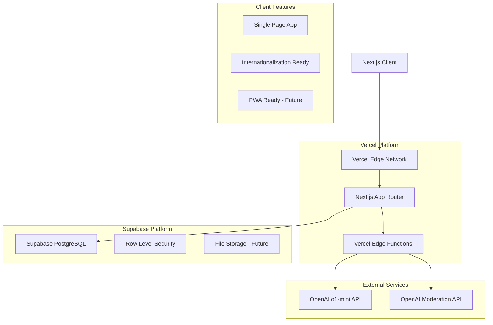
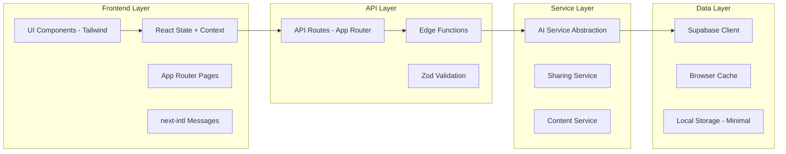
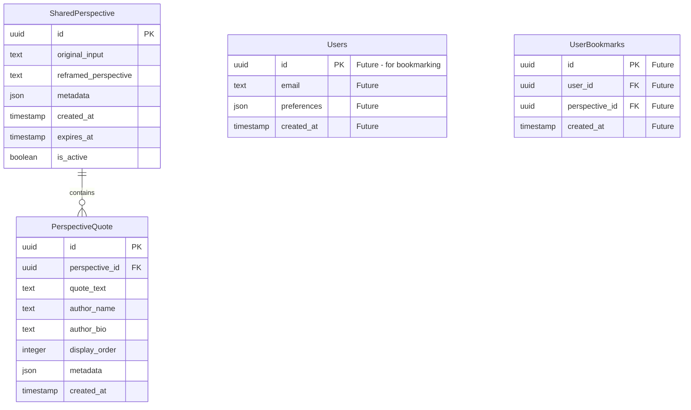
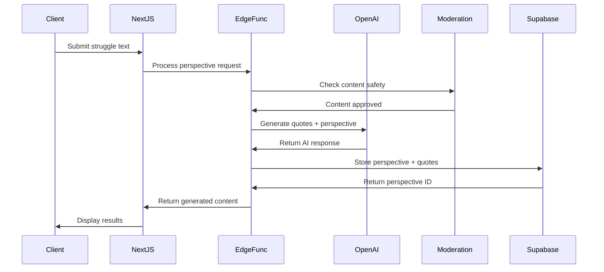
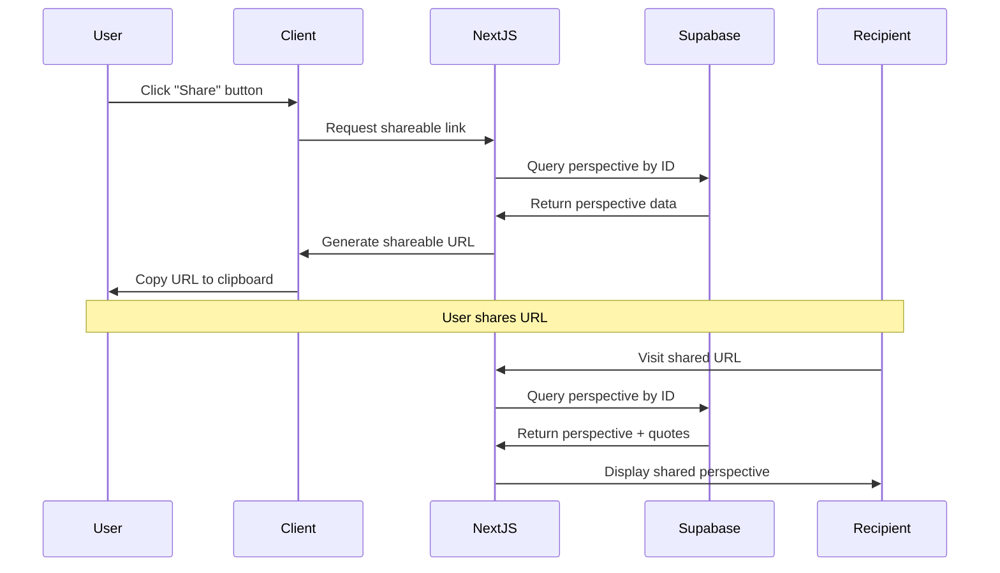

# Technical Requirements Document: Perspective Shift

**Generated from:** `prd-perspective-shift.md` + `drd-perspective-shift.md`  
**Date:** 2025-09-08  
**Technical Complexity:** Simple-to-Moderate  
**Target Stack:** Next.js 15 + Vercel + Supabase + OpenAI o1-mini  
**Future Requirements Considered:** User bookmarking, multi-language support, privacy-first design

## Executive Summary

### Technical Goals
- **Primary:** Build a fast, privacy-first single-page application with < 1,000 users/month capacity
- **Secondary:** Create cost-effective AI integration using OpenAI o1-mini for quote generation
- **Tertiary:** Establish foundation for future bookmarking and internationalization features

### Architecture Principles
- **Simplicity First:** Start with minimal complexity, avoid over-engineering for low traffic
- **Privacy-First:** No user tracking, minimal data collection, anonymous usage
- **Cost-Conscious:** Use o1-mini model, efficient caching, minimal database usage
- **Future-Ready:** i18n foundation, auth-ready architecture for bookmarking feature

### Future-Proofing Considerations
- **User Bookmarking:** Supabase auth and user tables ready to enable
- **Multi-language Support:** next-intl integration ready for content localization
- **Scaling:** Serverless architecture can handle traffic growth automatically
- **Enhanced AI:** Model switching capability built into service layer

### One-Way Door Decisions to Avoid
- **Hard-coded OpenAI dependency:** Abstract AI service to allow provider switching
- **Monolithic quote handling:** Modular quote system to support different formats
- **Fixed sharing mechanism:** Extensible sharing system for future platforms
- **English-only data models:** Database schema supports multi-language from start

## System Architecture

### High-Level Architecture


### Component Architecture


### Technology Stack

#### Core Platform (Optimized for Low Cost & Privacy)
```
Frontend Framework: Next.js 15.0+ (App Router)
- Reasoning: Perfect SSR/SSG balance, excellent Vercel integration, built-in optimization
- Server Components: Reduce client bundle size, improve performance
- Client Components: Only for interactive elements (form, copy buttons)
- Future compatibility: Built-in i18n support, auth patterns ready

Language: TypeScript 5.0+
- Strict configuration for better code quality
- Zod for runtime validation and type safety
- Future-proof: Easy to add complex types for user data

Styling: Tailwind CSS 3.4+
- Matches DRD requirements (gradients, glass morphism)
- Utility-first approach reduces CSS bundle size
- Dark mode ready (CSS variables approach)

Backend Platform: Vercel + Supabase
- Vercel Edge Functions: OpenAI API calls, content moderation
- Supabase PostgreSQL: Shareable links storage, future user data
- Supabase RLS: Privacy and security by design
- No traditional backend server needed (cost savings)

AI Integration: OpenAI o1-mini
- Cost-effective choice as requested
- Fast inference times suitable for Vercel timeout limits
- Strong reasoning capabilities for quote selection and perspective generation
```

#### Alternative Stack Considerations
```
Custom Backend: Not needed for current requirements
- Current serverless approach handles < 1,000 users easily
- Future scaling: Vercel automatically handles traffic increases
- Cost benefits: Pay per request instead of fixed server costs

Database Alternatives: Considered but rejected
- SQLite: No real-time features, harder to scale
- MongoDB: Overkill for simple relational data
- PlanetScale: More expensive than Supabase for low volume
```

### Scalability Strategy

#### Current Capacity Planning
```
Expected Load (< 1,000 users/month):
- ~33 users per day average
- ~2-3 concurrent users peak
- ~100 API requests per day
- ~$5-15/month operational cost

Vercel Limits (Hobby Plan):
- 100GB bandwidth/month (sufficient)
- 100 serverless function executions/day (sufficient)
- 10s function timeout (sufficient for AI processing)

Supabase Limits (Free Tier):
- 500MB database storage (sufficient for shareable links)
- 2GB bandwidth/month (sufficient)
- 50,000 monthly active users (far exceeds needs)
```

#### Scaling Triggers & Actions
```
If usage grows beyond current capacity:

Database Scaling:
- 500MB exceeded → Upgrade to Supabase Pro ($25/month)
- Query performance issues → Add database indexes
- Connection limits hit → Implement connection pooling

API Scaling:
- Vercel Hobby limits exceeded → Upgrade to Pro ($20/month)
- OpenAI rate limits hit → Implement request queuing
- Function timeout issues → Optimize AI prompts
```

## Data Architecture

### Database Design

#### Schema Overview


#### Core Tables Implementation
```sql
-- Enable UUID extension
CREATE EXTENSION IF NOT EXISTS "uuid-ossp";

-- Shared perspectives table
CREATE TABLE public.shared_perspectives (
    id UUID DEFAULT uuid_generate_v4() PRIMARY KEY,
    original_input TEXT NOT NULL,
    reframed_perspective TEXT NOT NULL,
    metadata JSONB DEFAULT '{}',
    created_at TIMESTAMP WITH TIME ZONE DEFAULT NOW(),
    expires_at TIMESTAMP WITH TIME ZONE, -- NULL = never expires
    is_active BOOLEAN DEFAULT true,
    
    -- Future columns ready
    user_id UUID, -- Will reference auth.users when bookmarking added
    language_code TEXT DEFAULT 'en',
    
    -- Constraints
    CONSTRAINT valid_input_length CHECK (LENGTH(original_input) >= 10 AND LENGTH(original_input) <= 2000),
    CONSTRAINT valid_perspective_length CHECK (LENGTH(reframed_perspective) >= 50)
);

-- Perspective quotes table
CREATE TABLE public.perspective_quotes (
    id UUID DEFAULT uuid_generate_v4() PRIMARY KEY,
    perspective_id UUID NOT NULL REFERENCES public.shared_perspectives(id) ON DELETE CASCADE,
    quote_text TEXT NOT NULL,
    author_name TEXT NOT NULL,
    author_bio TEXT,
    display_order INTEGER NOT NULL DEFAULT 1,
    metadata JSONB DEFAULT '{}',
    created_at TIMESTAMP WITH TIME ZONE DEFAULT NOW(),
    
    -- Constraints
    CONSTRAINT valid_quote_length CHECK (LENGTH(quote_text) >= 10 AND LENGTH(quote_text) <= 500),
    CONSTRAINT valid_author_name CHECK (LENGTH(author_name) >= 2),
    CONSTRAINT valid_display_order CHECK (display_order >= 1 AND display_order <= 3),
    
    -- Ensure max 3 quotes per perspective
    UNIQUE(perspective_id, display_order)
);

-- Indexes for performance
CREATE INDEX idx_shared_perspectives_created_at ON public.shared_perspectives(created_at);
CREATE INDEX idx_shared_perspectives_active ON public.shared_perspectives(is_active) WHERE is_active = true;
CREATE INDEX idx_perspective_quotes_perspective_id ON public.perspective_quotes(perspective_id);
CREATE INDEX idx_perspective_quotes_order ON public.perspective_quotes(perspective_id, display_order);

-- Future indexes ready for bookmarking
-- CREATE INDEX idx_shared_perspectives_user_id ON public.shared_perspectives(user_id);
```

#### Row Level Security (RLS) Policies
```sql
-- Enable RLS on all tables
ALTER TABLE public.shared_perspectives ENABLE ROW LEVEL SECURITY;
ALTER TABLE public.perspective_quotes ENABLE ROW LEVEL SECURITY;

-- Public read access for shared perspectives (since they're meant to be shared)
CREATE POLICY "Public read access for active shared perspectives"
    ON public.shared_perspectives FOR SELECT
    USING (is_active = true AND (expires_at IS NULL OR expires_at > NOW()));

-- Public read access for quotes of accessible perspectives
CREATE POLICY "Public read access for quotes of shared perspectives"
    ON public.perspective_quotes FOR SELECT
    USING (
        EXISTS (
            SELECT 1 FROM public.shared_perspectives sp 
            WHERE sp.id = perspective_id 
            AND sp.is_active = true 
            AND (sp.expires_at IS NULL OR sp.expires_at > NOW())
        )
    );

-- Anonymous insert for creating new perspectives (no auth required)
CREATE POLICY "Anonymous users can create perspectives"
    ON public.shared_perspectives FOR INSERT
    WITH CHECK (user_id IS NULL); -- Ensure no user_id for anonymous

CREATE POLICY "Anonymous users can create quotes"
    ON public.perspective_quotes FOR INSERT
    WITH CHECK (true); -- Quotes are always created with valid perspectives

-- Future policies ready for user bookmarking
-- CREATE POLICY "Users can manage their own perspectives"
--     ON public.shared_perspectives FOR ALL
--     USING (auth.uid() = user_id);
```

### Data Flow Architecture

#### Perspective Creation Flow


#### Shareable Link Flow


### Caching Strategy

#### Minimal Caching (Privacy-First Approach)
```
Browser Cache:
- Static assets (CSS, JS, images): 1 year
- API responses: No caching (privacy)
- Shared perspective pages: 1 hour (for performance)

CDN Cache (Vercel Edge):
- Static assets: Until deployment
- API routes: No caching (dynamic content)
- Shared perspective pages: 5 minutes (balance performance/freshness)

Application Cache:
- No server-side caching (privacy-first)
- No Redis/external cache (cost optimization)
- Browser-only quote data during session
```

#### Cache Keys & Invalidation
```
Vercel Edge Cache:
- Static assets: Based on file hash
- Shared perspectives: /share/[id] with 5-minute TTL
- No user-specific caching (anonymous usage)

Browser Cache:
- Perspective data: Session-only (no localStorage persistence)
- UI preferences: Browser preferences API only
- Copy feedback: Temporary UI state only
```

## API Design

### RESTful API Structure

#### Endpoint Categories
```
Perspective Generation:
POST /api/perspectives          # Create new perspective with quotes

Perspective Sharing:
GET  /api/perspectives/[id]     # Get shared perspective by ID
GET  /share/[id]                # Public sharing page (Next.js route)

Content Moderation:
POST /api/moderate              # Internal content moderation check

Health & Monitoring:
GET  /api/health                # Health check endpoint
```

#### Request/Response Patterns

##### Standard Success Response
```typescript
interface APIResponse<T> {
    success: true;
    data: T;
    message?: string;
}

// Example: Perspective creation
interface CreatePerspectiveResponse extends APIResponse<{
    id: string;
    reframedPerspective: string;
    quotes: Quote[];
    shareUrl: string;
}> {}
```

##### Standard Error Response
```typescript
interface APIError {
    success: false;
    error: {
        code: string;
        message: string;
        details?: Record<string, any>;
    };
    requestId: string;
}

// Common error codes
type ErrorCode = 
    | 'VALIDATION_ERROR'
    | 'CONTENT_MODERATION_FAILED'
    | 'AI_SERVICE_ERROR'
    | 'RATE_LIMIT_EXCEEDED'
    | 'PERSPECTIVE_NOT_FOUND'
    | 'INTERNAL_ERROR';
```

##### Input Validation Schemas
```typescript
import { z } from 'zod';

// Perspective creation request
export const CreatePerspectiveSchema = z.object({
    input: z.string()
        .min(10, 'Please share more details about your struggle')
        .max(2000, 'Please keep your input under 2000 characters')
        .trim(),
    language: z.enum(['en']).default('en'), // Ready for expansion
});

// Perspective sharing request
export const GetPerspectiveSchema = z.object({
    id: z.string().uuid('Invalid perspective ID'),
});

export type CreatePerspectiveRequest = z.infer<typeof CreatePerspectiveSchema>;
export type GetPerspectiveRequest = z.infer<typeof GetPerspectiveSchema>;
```

### Data Models

#### Core Types
```typescript
// Perspective-related types
export interface Perspective {
    id: string;
    originalInput: string;
    reframedPerspective: string;
    quotes: Quote[];
    metadata: {
        model: string; // AI model used
        processingTime: number;
        language: string;
    };
    createdAt: string;
    shareUrl: string;
}

export interface Quote {
    id: string;
    text: string;
    author: {
        name: string;
        bio: string;
    };
    displayOrder: number;
    metadata: {
        verificationSource?: string; // Future: quote source verification
    };
}

// AI Service types
export interface AIQuoteRequest {
    userInput: string;
    context: string;
    language: string;
}

export interface AIQuoteResponse {
    quotes: Array<{
        text: string;
        author: string;
        authorBio: string;
    }>;
    reframedPerspective: string;
    processingTime: number;
}

// Future types ready for bookmarking
export interface User {
    id: string;
    email: string;
    preferences: {
        language: string;
        notifications: boolean;
    };
    createdAt: string;
}

export interface Bookmark {
    id: string;
    userId: string;
    perspectiveId: string;
    createdAt: string;
}
```

### Authentication & Authorization

#### Current: Anonymous Access
```typescript
// No authentication required for MVP
// All perspectives are public via shareable links
export async function createPerspective(request: CreatePerspectiveRequest) {
    // No user validation needed
    // Content moderation only security layer
}

export async function getPerspective(id: string) {
    // Public access to any valid perspective ID
    // RLS policies ensure only active perspectives returned
}
```

#### Future: User Authentication Ready
```typescript
// Ready for Supabase Auth integration
import { createClient } from '@supabase/supabase-js';

export async function getAuthenticatedUser(request: Request) {
    const token = request.cookies.get('supabase-auth-token');
    if (!token) return null;
    
    const supabase = createClient(process.env.SUPABASE_URL!, process.env.SUPABASE_ANON_KEY!);
    const { data: { user } } = await supabase.auth.getUser(token.value);
    
    return user;
}

// Future bookmark functionality
export async function bookmarkPerspective(userId: string, perspectiveId: string) {
    const supabase = createClient(process.env.SUPABASE_URL!, process.env.SUPABASE_SERVICE_KEY!);
    
    return await supabase
        .from('user_bookmarks')
        .insert({ user_id: userId, perspective_id: perspectiveId });
}
```

## External Integrations

### OpenAI o1-mini Integration

#### Service Configuration
```typescript
// AI service abstraction for provider flexibility
export class AIService {
    private openai: OpenAI;
    
    constructor() {
        this.openai = new OpenAI({
            apiKey: process.env.OPENAI_API_KEY,
            // Use o1-mini for cost optimization
            defaultModel: 'o1-mini',
        });
    }
    
    async generatePerspective(input: string): Promise<AIQuoteResponse> {
        const prompt = this.buildPrompt(input);
        
        const completion = await this.openai.chat.completions.create({
            model: 'o1-mini',
            messages: [
                {
                    role: 'system',
                    content: this.getSystemPrompt()
                },
                {
                    role: 'user',
                    content: prompt
                }
            ],
            max_tokens: 1500, // Cost optimization
            temperature: 0.7,
        });
        
        return this.parseResponse(completion.choices[0].message.content);
    }
    
    private getSystemPrompt(): string {
        return `You are a wise counselor who helps people reframe their struggles through inspirational quotes and actionable perspectives.

        CRITICAL REQUIREMENTS:
        1. Use ONLY real, historically verified quotes from actual people
        2. Never fabricate or hallucinate quotes
        3. Provide exactly 3 quotes that directly relate to the user's struggle
        4. Include a 1-2 sentence biography for each quote author
        5. Generate a reframed perspective that offers hope and actionable solutions
        6. Maintain a supportive, positive tone throughout
        
        Response format must be valid JSON:
        {
            "reframedPerspective": "Your supportive reframing with actionable insights...",
            "quotes": [
                {
                    "text": "Verified quote text",
                    "author": "Author Name",
                    "authorBio": "Brief 1-2 sentence biography"
                }
            ]
        }`;
    }
}
```

#### Content Moderation Integration
```typescript
export class ModerationService {
    private openai: OpenAI;
    
    constructor() {
        this.openai = new OpenAI({
            apiKey: process.env.OPENAI_API_KEY,
        });
    }
    
    async moderateContent(input: string): Promise<{
        safe: boolean;
        categories: string[];
        reason?: string;
    }> {
        const moderation = await this.openai.moderations.create({
            input: input,
        });
        
        const result = moderation.results[0];
        
        if (result.flagged) {
            const flaggedCategories = Object.entries(result.categories)
                .filter(([_, flagged]) => flagged)
                .map(([category, _]) => category);
                
            return {
                safe: false,
                categories: flaggedCategories,
                reason: `Content flagged for: ${flaggedCategories.join(', ')}`
            };
        }
        
        return { safe: true, categories: [] };
    }
}
```

### Integration Architecture

#### Error Handling & Retry Logic
```typescript
export class ResilientAIService {
    private maxRetries = 3;
    private baseDelay = 1000; // 1 second
    
    async withRetry<T>(operation: () => Promise<T>): Promise<T> {
        for (let attempt = 0; attempt < this.maxRetries; attempt++) {
            try {
                return await operation();
            } catch (error) {
                if (this.isRetryableError(error) && attempt < this.maxRetries - 1) {
                    const delay = this.baseDelay * Math.pow(2, attempt);
                    await new Promise(resolve => setTimeout(resolve, delay));
                    continue;
                }
                throw this.enhanceError(error, attempt + 1);
            }
        }
        throw new Error('Max retries exceeded');
    }
    
    private isRetryableError(error: any): boolean {
        // Retry on rate limits, temporary API issues
        return error.status === 429 || error.status >= 500;
    }
    
    private enhanceError(error: any, attempts: number): Error {
        return new Error(`AI service failed after ${attempts} attempts: ${error.message}`);
    }
}
```

#### Cost Optimization
```typescript
export class CostOptimizedAIService extends ResilientAIService {
    private dailyUsage = 0;
    private dailyLimit = 100; // Requests per day
    
    async generatePerspective(input: string): Promise<AIQuoteResponse> {
        // Check daily limits
        if (this.dailyUsage >= this.dailyLimit) {
            throw new Error('Daily AI usage limit reached. Please try again tomorrow.');
        }
        
        // Use shorter prompts to reduce token usage
        const optimizedPrompt = this.optimizePrompt(input);
        
        const startTime = Date.now();
        const result = await this.withRetry(() => 
            this.callOpenAI(optimizedPrompt)
        );
        
        this.dailyUsage++;
        
        return {
            ...result,
            processingTime: Date.now() - startTime
        };
    }
    
    private optimizePrompt(input: string): string {
        // Trim input to essential information only
        const trimmedInput = input.substring(0, 500);
        return `Provide 3 real quotes and reframing for: "${trimmedInput}"`;
    }
}
```

## Security Architecture

### Security Requirements

#### Data Protection (Privacy-First)
```
Data Classification:
- Public: Shared perspectives (user consents to sharing)
- Anonymous: Original user inputs (no user identification)
- Internal: System logs, error tracking
- No Confidential or Restricted data (no PII collected)

Privacy Measures:
- No user tracking or analytics
- No persistent user identification
- No IP address logging beyond standard server logs
- No behavioral data collection
- User input stored only for shareable link functionality

Data Retention:
- Shared perspectives: Permanent (until manually deleted by link holder)
- System logs: 7 days maximum
- No user data: Nothing to retain
- API logs: Error tracking only, no request content
```

#### Access Control (Minimal Surface)
```
Authentication: None (anonymous access)
Authorization: 
- Public read access to shared perspectives
- No user roles or permissions needed
- RLS policies protect data integrity

Rate Limiting:
- 10 requests per minute per IP (prevent abuse)
- 100 requests per day per IP (cost control)
- Progressive delays for repeated requests

Content Security:
- OpenAI moderation API for all user inputs
- Input length limits (10-2000 characters)
- XSS prevention via React's built-in escaping
- CSRF protection via SameSite cookies
```

#### Security Implementation
```typescript
// Rate limiting middleware
import { Ratelimit } from '@upstash/ratelimit';
import { Redis } from '@upstash/redis';

// Use Vercel KV for rate limiting (cost-effective)
const ratelimit = new Ratelimit({
    redis: Redis.fromEnv(),
    limiter: Ratelimit.slidingWindow(10, '1 m'), // 10 requests per minute
    analytics: false, // Privacy-first
});

export async function withRateLimit(request: Request) {
    const ip = request.headers.get('x-forwarded-for') ?? 'anonymous';
    const { success, pending, limit, reset, remaining } = await ratelimit.limit(ip);
    
    if (!success) {
        throw new Error('Rate limit exceeded. Please try again later.');
    }
    
    return { remaining, reset };
}

// Input sanitization
export function sanitizeInput(input: string): string {
    // Remove potentially harmful content while preserving meaning
    return input
        .trim()
        .replace(/[<>]/g, '') // Remove HTML brackets
        .substring(0, 2000); // Enforce length limit
}

// Content Security Policy
export const securityHeaders = {
    'Content-Security-Policy': [
        "default-src 'self'",
        "script-src 'self' 'unsafe-eval' 'unsafe-inline'", // Next.js requirements
        "style-src 'self' 'unsafe-inline'", // Tailwind requirements
        "img-src 'self' data: https:",
        "connect-src 'self' https://*.supabase.co https://api.openai.com",
        "frame-ancestors 'none'",
    ].join('; '),
    'X-Frame-Options': 'DENY',
    'X-Content-Type-Options': 'nosniff',
    'Referrer-Policy': 'strict-origin-when-cross-origin',
    'X-XSS-Protection': '1; mode=block',
};
```

## Performance Architecture  

### Performance Requirements

#### Target Metrics (Based on DRD)
```
Core Web Vitals:
- Largest Contentful Paint (LCP): < 2.5s
- First Input Delay (FID): < 100ms  
- Cumulative Layout Shift (CLS): < 0.1
- First Contentful Paint (FCP): < 1.8s

API Performance:
- Perspective generation: < 10s (limited by AI processing)
- Shared perspective loading: < 500ms
- Form validation: < 100ms
- Copy-to-clipboard: < 50ms

User Experience:
- Time to Interactive: < 3.0s
- Form response time: Immediate feedback
- Skeleton loading: Visible within 200ms
```

#### Optimization Strategies

##### Frontend Performance
```typescript
// Next.js App Router optimizations
// app/layout.tsx
import { Inter } from 'next/font/google';

// Font optimization
const inter = Inter({
    subsets: ['latin'],
    display: 'swap', // Prevent invisible text during font load
    preload: true,
});

// Component code splitting
import { lazy, Suspense } from 'react';

const QuotesDisplay = lazy(() => import('./QuotesDisplay'));

export default function ResultsPage() {
    return (
        <Suspense fallback={<QuotesSkeleton />}>
            <QuotesDisplay />
        </Suspense>
    );
}

// Critical CSS inlining (automatic with Tailwind + Next.js)
// Unused CSS purging (automatic with Tailwind)
```

##### Asset Optimization
```typescript
// Image optimization (for future use)
import Image from 'next/image';

// Gradient background (CSS instead of images for performance)
const gradientStyles = {
    background: 'linear-gradient(135deg, #FF8FB1 0%, #C8A8E9 100%)',
};

// Bundle analysis in package.json
{
    "scripts": {
        "analyze": "ANALYZE=true next build"
    }
}
```

##### API Performance
```typescript
// Edge function optimization
export const config = {
    runtime: 'edge', // Faster cold starts than Node.js runtime
    regions: ['iad1'], // Single region for cost optimization
};

// Efficient database queries
export async function getPerspectiveWithQuotes(id: string) {
    const { data, error } = await supabase
        .from('shared_perspectives')
        .select(`
            id,
            original_input,
            reframed_perspective,
            created_at,
            perspective_quotes (
                quote_text,
                author_name,
                author_bio,
                display_order
            )
        `)
        .eq('id', id)
        .eq('is_active', true)
        .single();
        
    return data;
}

// Response compression
export function compressResponse(data: any) {
    return new Response(JSON.stringify(data), {
        headers: {
            'Content-Type': 'application/json',
            'Content-Encoding': 'gzip', // Automatic with Vercel
        },
    });
}
```

#### Performance Monitoring
```typescript
// Web Vitals tracking (privacy-friendly)
import { getCLS, getFID, getFCP, getLCP, getTTFB } from 'web-vitals';

export function reportWebVitals() {
    // Only log to console in development (no external tracking)
    if (process.env.NODE_ENV === 'development') {
        getCLS(console.log);
        getFID(console.log);
        getFCP(console.log);
        getLCP(console.log);
        getTTFB(console.log);
    }
}

// API performance tracking
export async function withPerformanceTracking<T>(
    operation: () => Promise<T>,
    operationName: string
): Promise<T> {
    const startTime = Date.now();
    
    try {
        const result = await operation();
        const duration = Date.now() - startTime;
        
        // Log performance metrics (development only)
        if (process.env.NODE_ENV === 'development') {
            console.log(`${operationName}: ${duration}ms`);
        }
        
        return result;
    } catch (error) {
        const duration = Date.now() - startTime;
        console.error(`${operationName} failed after ${duration}ms:`, error);
        throw error;
    }
}
```

## Complexity Management

### Technical Complexity Levels

#### Level 1: Minimal Implementation (Circuit Breaker)
**Scope:** Basic functionality with maximum cost efficiency
- **Architecture:** Single Next.js app, minimal API routes
- **Database:** Simple flat schema, no relationships
- **AI:** Basic OpenAI calls with no retry logic
- **UI:** HTML forms, basic CSS, no animations
- **Error Handling:** Simple try/catch, generic error messages
- **Sharing:** Basic URL parameters, no database storage

**When to use:** If OpenAI costs exceed budget, or development time is severely constrained

#### Level 2: Standard Implementation (Target)
**Scope:** Full feature set optimized for requirements
- **Architecture:** Structured Next.js app with proper separation
- **Database:** Normalized schema with RLS policies
- **AI:** Resilient service with retry logic and cost optimization  
- **UI:** Tailwind design system, smooth animations, loading states
- **Error Handling:** Detailed error types, user-friendly messages
- **Sharing:** Persistent database storage, permanent links

**Implementation details:** As specified throughout this document

#### Level 3: Enhanced Implementation (Future Growth)
**Scope:** Enterprise-ready with advanced features
- **Architecture:** Microservices, event-driven updates
- **Database:** Advanced optimization, read replicas, caching
- **AI:** Multiple providers, A/B testing, quote verification
- **UI:** Advanced animations, PWA features, offline support
- **Error Handling:** Comprehensive logging, monitoring, alerting
- **Sharing:** Advanced analytics, user tracking, social features

**When to consider:** When user base grows beyond 10,000/month

### Technical Circuit Breakers

#### AI Service Circuit Breakers
- **o1-mini → GPT-3.5-turbo:** If o1-mini proves too expensive
- **OpenAI → Static quotes:** Fallback to curated quote database during API outages
- **Real-time generation → Pre-generated:** Cache common perspectives for cost savings

#### Database Circuit Breakers
- **Supabase → Local SQLite:** If hosting costs exceed budget
- **Persistent sharing → Session-only:** Remove database, use URL encoding for sharing
- **Complex schema → Simple JSON:** Store all data as JSON blobs in single table

#### UI Circuit Breakers
- **Tailwind → Basic CSS:** Remove design system if bundle size is problematic
- **Smooth animations → Instant transitions:** Remove animations for performance
- **Interactive components → Static forms:** Simplify UI for faster development

## Deployment Architecture

### Infrastructure Setup

#### Vercel Configuration
```json
{
    "framework": "nextjs",
    "buildCommand": "npm run build",
    "outputDirectory": ".next",
    "installCommand": "npm ci",
    
    "functions": {
        "app/api/**": {
            "maxDuration": 10,
            "runtime": "edge"
        }
    },
    
    "env": {
        "NEXT_PUBLIC_SUPABASE_URL": "@supabase-url",
        "NEXT_PUBLIC_SUPABASE_ANON_KEY": "@supabase-anon-key"
    },
    
    "headers": [
        {
            "source": "/(.*)",
            "headers": [
                {
                    "key": "X-Frame-Options",
                    "value": "DENY"
                },
                {
                    "key": "X-Content-Type-Options", 
                    "value": "nosniff"
                }
            ]
        }
    ]
}
```

#### Environment Configuration
```bash
# Production Environment Variables
NEXT_PUBLIC_SUPABASE_URL=https://[project].supabase.co
NEXT_PUBLIC_SUPABASE_ANON_KEY=eyJ...
SUPABASE_SERVICE_ROLE_KEY=eyJ... # For server operations

# OpenAI Configuration
OPENAI_API_KEY=sk-...

# Application Configuration
NODE_ENV=production
NEXT_PUBLIC_APP_URL=https://perspective-shift.vercel.app

# Rate Limiting (Vercel KV)
KV_REST_API_URL=https://...
KV_REST_API_TOKEN=...
```

### Deployment Pipeline

#### GitHub Actions CI/CD
```yaml
name: Deploy Perspective Shift
on:
    push:
        branches: [main]
    pull_request:
        branches: [main]

env:
    VERCEL_ORG_ID: ${{ secrets.VERCEL_ORG_ID }}
    VERCEL_PROJECT_ID: ${{ secrets.VERCEL_PROJECT_ID }}

jobs:
    test:
        runs-on: ubuntu-latest
        steps:
            - uses: actions/checkout@v4
            - uses: actions/setup-node@v4
              with:
                  node-version: '20'
                  cache: 'npm'
            
            - run: npm ci
            - run: npm run lint
            - run: npm run type-check
            - run: npm run test
            
    deploy:
        runs-on: ubuntu-latest
        needs: test
        if: github.ref == 'refs/heads/main'
        steps:
            - uses: actions/checkout@v4
            - uses: actions/setup-node@v4
              with:
                  node-version: '20'
                  cache: 'npm'
                  
            - run: npm ci
            - run: npm run build
            
            - uses: amondnet/vercel-action@v25
              with:
                  vercel-token: ${{ secrets.VERCEL_TOKEN }}
                  vercel-org-id: ${{ secrets.VERCEL_ORG_ID }}
                  vercel-project-id: ${{ secrets.VERCEL_PROJECT_ID }}
```

#### Database Migrations (Supabase)
```sql
-- Migration: 001_initial_schema.sql
-- Create initial tables for perspective sharing

-- Migration: 002_add_indexes.sql  
-- Add performance indexes

-- Migration: 003_future_user_tables.sql
-- Add user tables for bookmarking (disabled initially)
-- CREATE TABLE IF NOT EXISTS users (...);
-- Commented out until needed

-- Migration strategy:
-- 1. All migrations are reversible
-- 2. Future features pre-planned but disabled
-- 3. No breaking changes to existing data
```

## Testing Strategy

### Testing Architecture

#### Unit Testing (Jest + Testing Library)
```typescript
// Quote generation service tests
import { AIService } from '@/lib/ai-service';

describe('AIService', () => {
    let aiService: AIService;
    
    beforeEach(() => {
        aiService = new AIService();
        // Mock OpenAI API for tests
        jest.mocked(openai.chat.completions.create).mockResolvedValue(mockResponse);
    });
    
    describe('generatePerspective', () => {
        it('should generate valid perspective with quotes', async () => {
            const result = await aiService.generatePerspective('I am struggling with work stress');
            
            expect(result.quotes).toHaveLength(3);
            expect(result.reframedPerspective).toBeTruthy();
            expect(result.quotes[0]).toHaveProperty('author');
            expect(result.quotes[0]).toHaveProperty('text');
        });
        
        it('should handle API errors gracefully', async () => {
            jest.mocked(openai.chat.completions.create).mockRejectedValue(new Error('API Error'));
            
            await expect(aiService.generatePerspective('test'))
                .rejects
                .toThrow('AI service failed');
        });
    });
});

// Component tests
import { render, screen, fireEvent, waitFor } from '@testing-library/react';
import PerspectiveForm from '@/components/PerspectiveForm';

describe('PerspectiveForm', () => {
    it('should validate input length', async () => {
        render(<PerspectiveForm />);
        
        const input = screen.getByPlaceholderText(/Share what you're struggling with/);
        const submit = screen.getByRole('button', { name: /Submit/ });
        
        // Test minimum length validation
        fireEvent.change(input, { target: { value: 'short' } });
        fireEvent.click(submit);
        
        await waitFor(() => {
            expect(screen.getByText(/Please share more details/)).toBeInTheDocument();
        });
    });
});
```

#### Integration Testing (Database + API)
```typescript
import { createClient } from '@supabase/supabase-js';

describe('Perspective API Integration', () => {
    let supabase: SupabaseClient;
    
    beforeAll(async () => {
        // Use test database
        supabase = createClient(
            process.env.SUPABASE_TEST_URL!,
            process.env.SUPABASE_TEST_ANON_KEY!
        );
    });
    
    afterEach(async () => {
        // Clean up test data
        await supabase.from('shared_perspectives').delete().neq('id', '');
    });
    
    it('should create and retrieve perspective', async () => {
        const perspectiveData = {
            original_input: 'Test struggle input',
            reframed_perspective: 'Test reframed perspective',
            quotes: [
                {
                    quote_text: 'Test quote',
                    author_name: 'Test Author',
                    author_bio: 'Test bio',
                    display_order: 1
                }
            ]
        };
        
        // Create perspective
        const response = await fetch('/api/perspectives', {
            method: 'POST',
            headers: { 'Content-Type': 'application/json' },
            body: JSON.stringify({ input: perspectiveData.original_input })
        });
        
        expect(response.ok).toBe(true);
        const result = await response.json();
        expect(result.success).toBe(true);
        expect(result.data.id).toBeTruthy();
        
        // Retrieve perspective
        const getResponse = await fetch(`/api/perspectives/${result.data.id}`);
        const retrievedPerspective = await getResponse.json();
        
        expect(retrievedPerspective.success).toBe(true);
        expect(retrievedPerspective.data.quotes).toHaveLength(3);
    });
});
```

#### End-to-End Testing (Playwright)
```typescript
import { test, expect } from '@playwright/test';

test.describe('Perspective Shift App', () => {
    test('complete user journey - create and share perspective', async ({ page }) => {
        // Navigate to home page
        await page.goto('/');
        
        // Check initial state
        await expect(page.getByText('Share what you\'re struggling with')).toBeVisible();
        
        // Fill out form
        const textarea = page.getByRole('textbox');
        await textarea.fill('I am struggling with work-life balance and feeling overwhelmed');
        
        // Submit form
        await page.getByRole('button', { name: /submit/i }).click();
        
        // Wait for loading to complete
        await expect(page.locator('[data-testid="loading-skeleton"]')).toBeVisible();
        await expect(page.locator('[data-testid="loading-skeleton"]')).not.toBeVisible({ timeout: 15000 });
        
        // Verify results are displayed
        await expect(page.getByTestId('reframed-perspective')).toBeVisible();
        await expect(page.locator('[data-testid="quote-card"]')).toHaveCount(3);
        
        // Test copy functionality
        await page.getByTestId('copy-quote-1').click();
        await expect(page.getByText('Copied!')).toBeVisible();
        
        // Test sharing
        await page.getByTestId('share-button').click();
        const shareUrl = await page.getByTestId('share-url').textContent();
        expect(shareUrl).toContain('/share/');
        
        // Test shared link works
        await page.goto(shareUrl!);
        await expect(page.getByTestId('reframed-perspective')).toBeVisible();
        await expect(page.locator('[data-testid="quote-card"]')).toHaveCount(3);
    });
    
    test('form validation works correctly', async ({ page }) => {
        await page.goto('/');
        
        // Test empty submission
        await page.getByRole('button', { name: /submit/i }).click();
        await expect(page.getByText(/Please share more details/)).toBeVisible();
        
        // Test too short input
        await page.getByRole('textbox').fill('short');
        await page.getByRole('button', { name: /submit/i }).click();
        await expect(page.getByText(/Please share more details/)).toBeVisible();
        
        // Test valid input
        await page.getByRole('textbox').fill('I am struggling with motivation and focus in my daily work tasks');
        await page.getByRole('button', { name: /submit/i }).click();
        await expect(page.getByText(/Please share more details/)).not.toBeVisible();
    });
});
```

#### Performance Testing
```typescript
// Load testing with k6
import http from 'k6/http';
import { check, sleep } from 'k6';

export const options = {
    stages: [
        { duration: '30s', target: 10 }, // Ramp up
        { duration: '1m', target: 10 },  // Stay at 10 users
        { duration: '30s', target: 0 },  // Ramp down
    ],
};

export default function () {
    // Test perspective creation
    const payload = JSON.stringify({
        input: 'I am struggling with time management and productivity'
    });
    
    const response = http.post('https://perspective-shift.vercel.app/api/perspectives', payload, {
        headers: { 'Content-Type': 'application/json' },
    });
    
    check(response, {
        'status is 200': (r) => r.status === 200,
        'response time < 10s': (r) => r.timings.duration < 10000,
        'has perspective data': (r) => JSON.parse(r.body).data.reframedPerspective,
    });
    
    sleep(1);
}
```

## Monitoring & Observability

### Application Monitoring (Privacy-First)

#### Metrics Collection (No User Tracking)
```typescript
// Simple performance metrics without user identification
export class PrivacyFirstMetrics {
    private metrics: Map<string, number[]> = new Map();
    
    recordResponseTime(endpoint: string, duration: number) {
        if (!this.metrics.has(endpoint)) {
            this.metrics.set(endpoint, []);
        }
        
        const times = this.metrics.get(endpoint)!;
        times.push(duration);
        
        // Keep only last 100 measurements to limit memory
        if (times.length > 100) {
            times.shift();
        }
    }
    
    getMetrics(endpoint: string) {
        const times = this.metrics.get(endpoint) || [];
        if (times.length === 0) return null;
        
        const sorted = [...times].sort((a, b) => a - b);
        
        return {
            count: times.length,
            avg: times.reduce((a, b) => a + b, 0) / times.length,
            p50: sorted[Math.floor(sorted.length * 0.5)],
            p95: sorted[Math.floor(sorted.length * 0.95)],
            p99: sorted[Math.floor(sorted.length * 0.99)],
        };
    }
}

// Usage in API routes
export async function POST(request: Request) {
    const startTime = Date.now();
    
    try {
        const result = await createPerspective(request);
        
        // Record successful response time
        metrics.recordResponseTime('/api/perspectives', Date.now() - startTime);
        
        return Response.json({ success: true, data: result });
    } catch (error) {
        // Record error metrics without sensitive data
        console.error('Perspective creation failed:', {
            error: error.message,
            duration: Date.now() - startTime,
            timestamp: new Date().toISOString(),
        });
        
        return Response.json({ 
            success: false, 
            error: { code: 'CREATION_FAILED', message: 'Unable to create perspective' }
        }, { status: 500 });
    }
}
```

#### Health Monitoring
```typescript
// Health check endpoint
export async function GET() {
    const health = {
        status: 'healthy',
        timestamp: new Date().toISOString(),
        checks: {
            database: await checkDatabase(),
            openai: await checkOpenAI(),
            memory: process.memoryUsage(),
        }
    };
    
    const isHealthy = Object.values(health.checks).every(check => 
        typeof check === 'object' ? check.status === 'healthy' : true
    );
    
    return Response.json(health, { 
        status: isHealthy ? 200 : 503 
    });
}

async function checkDatabase(): Promise<{ status: string; responseTime?: number }> {
    try {
        const startTime = Date.now();
        await supabase.from('shared_perspectives').select('count').limit(1);
        
        return {
            status: 'healthy',
            responseTime: Date.now() - startTime
        };
    } catch (error) {
        return { status: 'unhealthy' };
    }
}

async function checkOpenAI(): Promise<{ status: string }> {
    try {
        // Lightweight check - just verify API key is valid
        const response = await fetch('https://api.openai.com/v1/models', {
            headers: { 'Authorization': `Bearer ${process.env.OPENAI_API_KEY}` }
        });
        
        return { status: response.ok ? 'healthy' : 'unhealthy' };
    } catch (error) {
        return { status: 'unhealthy' };
    }
}
```

#### Error Tracking (Minimal)
```typescript
// Simple error logging without external services
export class SimpleErrorTracker {
    private errors: Array<{
        timestamp: string;
        error: string;
        endpoint: string;
        count: number;
    }> = [];
    
    trackError(error: Error, endpoint: string) {
        const errorKey = `${endpoint}:${error.message}`;
        const existing = this.errors.find(e => 
            e.endpoint === endpoint && e.error === error.message
        );
        
        if (existing) {
            existing.count++;
            existing.timestamp = new Date().toISOString();
        } else {
            this.errors.push({
                timestamp: new Date().toISOString(),
                error: error.message,
                endpoint,
                count: 1
            });
        }
        
        // Keep only recent errors to limit memory
        if (this.errors.length > 50) {
            this.errors.shift();
        }
        
        // Log critical errors to console
        if (this.isCriticalError(error)) {
            console.error('Critical error:', {
                endpoint,
                error: error.message,
                timestamp: new Date().toISOString(),
            });
        }
    }
    
    private isCriticalError(error: Error): boolean {
        const criticalPatterns = [
            'OpenAI API key',
            'Database connection',
            'Supabase',
            'Rate limit exceeded'
        ];
        
        return criticalPatterns.some(pattern => 
            error.message.includes(pattern)
        );
    }
}
```

## Implementation Notes

### Development Workflow

#### Local Development Setup
```bash
# Environment setup
cp .env.example .env.local
# Add required environment variables:
# NEXT_PUBLIC_SUPABASE_URL=your-supabase-url
# NEXT_PUBLIC_SUPABASE_ANON_KEY=your-anon-key
# SUPABASE_SERVICE_ROLE_KEY=your-service-key
# OPENAI_API_KEY=your-openai-key

# Install dependencies
npm install

# Set up database schema
npm run db:setup

# Run development server
npm run dev

# Run tests
npm run test
npm run test:e2e
```

#### Project Structure
```
perspective-shift/
├── app/                    # Next.js App Router
│   ├── (routes)/
│   │   ├── page.tsx       # Home page with input form
│   │   └── share/
│   │       └── [id]/
│   │           └── page.tsx # Shared perspective view
│   ├── api/
│   │   ├── perspectives/
│   │   │   ├── route.ts   # Create perspective
│   │   │   └── [id]/
│   │   │       └── route.ts # Get perspective
│   │   └── health/
│   │       └── route.ts   # Health check
│   ├── globals.css        # Tailwind styles
│   └── layout.tsx         # Root layout
├── components/
│   ├── forms/
│   │   └── PerspectiveForm.tsx
│   ├── display/
│   │   ├── QuoteCard.tsx
│   │   ├── PerspectiveCard.tsx
│   │   └── ShareButton.tsx
│   └── ui/
│       ├── Button.tsx
│       ├── Card.tsx
│       └── LoadingSkeleton.tsx
├── lib/
│   ├── ai-service.ts      # OpenAI integration
│   ├── database.ts        # Supabase client
│   ├── validation.ts      # Zod schemas
│   └── utils.ts          # Helper functions
├── types/
│   ├── perspective.ts     # Data types
│   └── api.ts            # API types
├── __tests__/
│   ├── unit/
│   ├── integration/
│   └── e2e/
└── public/
    └── icons/            # App icons
```

#### Code Quality Configuration
```json
// .eslintrc.json
{
    "extends": [
        "next/core-web-vitals",
        "@typescript-eslint/recommended",
        "prettier"
    ],
    "rules": {
        "@typescript-eslint/no-unused-vars": "error",
        "prefer-const": "error",
        "no-var": "error"
    }
}

// prettier.config.js
module.exports = {
    semi: true,
    trailingComma: 'es5',
    singleQuote: true,
    printWidth: 100,
    tabWidth: 4,
}

// tsconfig.json
{
    "compilerOptions": {
        "target": "ES2017",
        "lib": ["dom", "dom.iterable", "ES6"],
        "allowJs": true,
        "skipLibCheck": true,
        "strict": true,
        "forceConsistentCasingInFileNames": true,
        "noEmit": true,
        "esModuleInterop": true,
        "module": "esnext",
        "moduleResolution": "node",
        "resolveJsonModule": true,
        "isolatedModules": true,
        "jsx": "preserve",
        "incremental": true,
        "plugins": [{ "name": "next" }],
        "paths": {
            "@/*": ["./*"]
        }
    }
}
```

### Migration Strategy (New Project)

#### Phase 1: MVP Implementation (Week 1-2)
```
Core Features:
✓ Basic Next.js setup with TypeScript
✓ Tailwind CSS configuration
✓ Supabase integration and schema
✓ OpenAI o1-mini integration
✓ Basic form with validation
✓ Perspective generation and display
✓ Simple sharing via URLs
✓ Mobile-responsive design

Testing:
✓ Unit tests for services
✓ Basic integration tests
✓ Manual UI testing
```

#### Phase 2: Polish & Performance (Week 3)
```
Enhancements:
✓ Loading states and skeleton screens
✓ Error handling and user feedback
✓ Copy-to-clipboard functionality
✓ Performance optimizations
✓ Accessibility improvements
✓ SEO optimization

Testing:
✓ E2E tests with Playwright
✓ Performance testing
✓ Cross-browser testing
```

#### Phase 3: Production & Monitoring (Week 4)
```
Production Ready:
✓ Environment configuration
✓ CI/CD pipeline setup
✓ Health monitoring
✓ Error tracking
✓ Performance monitoring
✓ Security hardening

Launch:
✓ Domain setup
✓ SSL certificates
✓ Monitoring alerts
✓ Backup procedures
```

## Success Metrics

### Technical Success Criteria
- **Performance:** All Core Web Vitals targets met (LCP < 2.5s, FID < 100ms, CLS < 0.1)
- **Reliability:** 99.5% uptime (acceptable for low-traffic MVP)
- **Cost Efficiency:** Monthly operational costs under $25
- **Security:** No security vulnerabilities, content moderation functioning

### Development Efficiency Metrics
- **Development Speed:** MVP completed in 2-4 weeks
- **Code Quality:** TypeScript strict mode, 80%+ test coverage
- **Maintainability:** Clear architecture, comprehensive documentation
- **Future Readiness:** Internationalization and user accounts ready to enable

## Open Questions

### Technical Decisions Requiring Input
- **Quote verification:** Should we implement any additional verification beyond strong prompting?
- **Content caching:** Worth implementing perspective caching for common inputs to reduce AI costs?
- **Error recovery:** Should failed AI requests have human fallback quotes or just retry?
- **Performance monitoring:** Is console logging sufficient or should we add minimal external monitoring?

### Future Technical Considerations
- **User authentication:** When bookmarking becomes priority, which auth providers to support?
- **Internationalization:** Should we prepare for RTL languages or just left-to-right initially?
- **Mobile app:** How should the architecture accommodate future native mobile apps?
- **API versioning:** Should we version the API from launch for future breaking changes?

### Risk Assessment
- **OpenAI dependency:** Single provider risk, should we prepare fallback providers?
- **Cost escalation:** What usage patterns could cause unexpected cost spikes?
- **Performance bottlenecks:** Database query performance with growth
- **Security vulnerabilities:** Content injection attacks, API abuse

## Conclusion

This Technical Requirements Document provides a comprehensive foundation for building the Perspective Shift application with a focus on privacy, cost-effectiveness, and future scalability. The architecture balances simplicity for current needs with extensibility for future features like user bookmarking and internationalization.

The recommended stack (Next.js + Vercel + Supabase + OpenAI o1-mini) optimizes for the stated requirements: low volume usage, cost consciousness, privacy-first design, and rapid development. The circuit breaker patterns ensure the project can adapt if constraints change during development.

Key implementation priorities:
1. Start with Level 2 (Standard Implementation) 
2. Implement privacy-first monitoring from day one
3. Build i18n and auth foundations without enabling them
4. Focus on Core Web Vitals and user experience
5. Maintain cost awareness throughout development